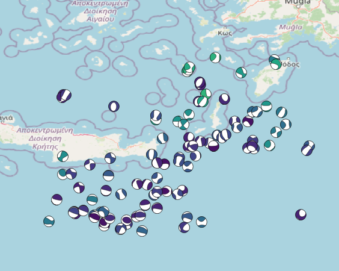

# QBeachball

Easily plot focal mechanisms on QGIS



[](https://www.buymeacoffee.com/elymperis)

## Dev

### Install

Use the export script to create a release folder and symlink it to your QGIS plugins folder

```bash
python ./scripts/export.py --install --name qbeachball
```
